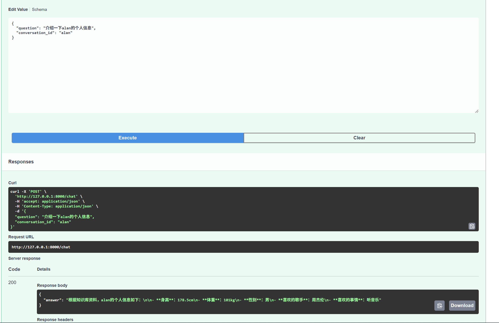
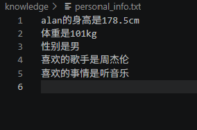
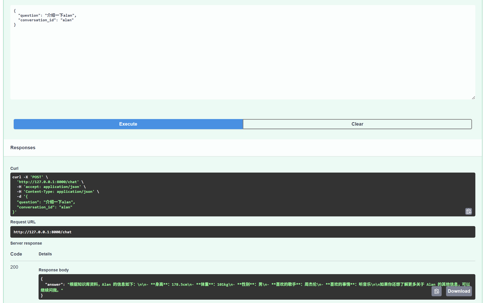
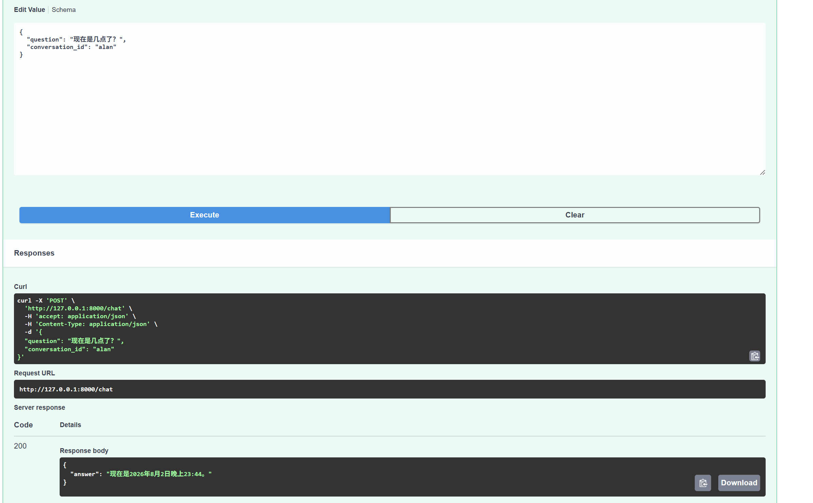

AI Knowledge Assistant

基于大语言模型（LLM）的智能知识助手系统。

项目通过 LLM + RAG + Memory + Tools 架构，实现具备长期记忆、知识检索、工具调用能力的 AI 助手。

用户可以通过自然语言进行问答，系统能够结合个人知识库内容、历史对话记录以及外部工具完成更加准确的回答。

## Demo

1.基础对话

2.RAG

3.Function calling

项目特点
✅ 基于大语言模型实现智能对话
✅ 支持多轮对话记忆
✅ 基于 RAG 实现私有知识库问答
✅ 支持 Function Calling 调用外部工具
✅ Redis 存储短期对话上下文
✅ PostgreSQL 保存长期聊天记录
✅ FastAPI 构建高性能 API 服务
✅ ChromaDB 作为向量数据库
系统架构
                    User
                     |
                     |
                FastAPI API
                     |
        -----------------------------
        |             |             |
        |             |             |
      Memory         RAG          Tools
        |             |             |
     Redis        ChromaDB      Function
        |             |             |
        |             |             |
        ----------- LLM ------------
                     |
                     |
              DeepSeek API

                     |
                     |
              PostgreSQL

核心功能
1. 基于 LLM 的智能问答

使用 OpenAI SDK 调用 DeepSeek 大语言模型。

支持：

System Prompt 控制模型行为
多轮上下文管理
流式输出

示例：

用户：

介绍一下FastAPI

系统：

FastAPI是一个基于Python的现代Web框架...
2. 多轮对话 Memory

为了让模型具备上下文理解能力，引入 Memory 模块。

架构：

用户输入

↓

Redis

↓

历史消息

↓

LLM

保存格式：

[
 {
  "role":"user",
  "content":"我叫Alan"
 },
 {
  "role":"assistant",
  "content":"你好Alan"
 }
]

支持：

conversation_id 管理不同会话
历史消息自动加载
上下文窗口控制
3. RAG 知识库问答

通过 Retrieval Augmented Generation 实现私有知识增强。

流程：

Knowledge Documents

↓

Embedding Model

↓

Vector Database

↓

Similarity Search

↓

Retrieved Context

↓

LLM Answer

当前支持：

knowledge/

├── fastapi.txt
├── llm.txt
├── redis.txt
└── personal_info.txt

用户问题：

Alan是谁？

系统：

将问题向量化
在 ChromaDB 搜索相关知识
将检索结果加入 Prompt
LLM 生成答案
4. Function Calling 工具调用

支持 LLM 根据用户需求调用外部工具。

例如：

用户：

现在几点？

模型判断：

调用 get_current_time 工具

执行：

get_current_time()

返回：

当前时间：2026-08-02 14:30

流程：

User

↓

LLM

↓

Tool Call

↓

Python Function

↓

Tool Result

↓

LLM

↓

Final Answer

5. 数据存储
Redis

用于：

保存短期聊天历史
提供快速上下文访问

数据结构：

chat:{conversation_id}

[
 {
  "role":"user",
  "content":"你好"
 }
]
PostgreSQL

用于：

长期保存：

用户消息
AI回复
对话记录

数据库结构：

messages

id
conversation_id
role
content
created_time

技术栈
Backend
Python
FastAPI
Uvicorn
LLM
DeepSeek API
OpenAI SDK
RAG
ChromaDB
Sentence Transformers
Embedding Model
Database
Redis
PostgreSQL
SQLAlchemy
Development
Git
Docker
PyCharm / VSCode
项目结构
AI-knowledge-assistant

├── app

│   ├── api
│   │   ├── chat.py
│   │   └── conversation.py
│
│   ├── core
│   │   ├── config.py
│   │   ├── logger.py
│   │   └── prompts.py
│
│   ├── services
│   │   ├── llm.py
│   │   ├── memory.py
│   │   └── db_service.py
│
│   ├── rag
│   │   ├── embedding.py
│   │   ├── retriever.py
│   │   └── vector_store.py
│
│   ├── tools
│
│   └── models
│
├── knowledge
│
├── chroma
│
├── requirements.txt
│
└── README.md

API 示例

启动：

python -m uvicorn app.main:app --reload

访问：

http://127.0.0.1:8000/docs

请求：

POST /chat

{
 "conversation_id":"001",
 "question":"Redis是什么？"
}

返回：

Redis是一种开源的内存数据库...
已完成模块
 FastAPI 后端服务
 LLM 对话接口
 DeepSeek API 接入
 Prompt 管理
 Redis Memory
 PostgreSQL 数据持久化
 Function Calling
 Chroma 向量数据库
 Embedding 检索
 RAG 知识库
后续优化方向
 文档上传系统
 PDF 自动解析
 文档 Chunk 切分优化
 RAG 重排序（Rerank）
 用户认证系统
 前端聊天界面
 Docker 部署
 Agent 工作流
项目总结

该项目实现了一个具备：

知识增强能力
长短期记忆能力
工具调用能力

的 AI Agent 应用系统。

通过结合 LLM、RAG、Memory 和 Tools，实现从基础聊天机器人向企业级 AI 应用助手的升级。